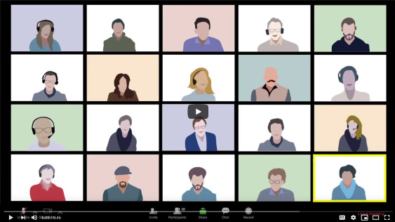

[Home](README.md)   |   [Calendar](calendar.md)

# Welcome to Oracle's Virtual Code Innovate Event Repository

Virtual Code Innovate is a [2-3 day online event](code_innovate_11_18_pitch.pdf) where Oracle engineers will codevelop with you on use cases in the Cloud. This github project contains the core checklists, templates and coordination links required to execute the online event.

Sounds Interesting..

Teams
---
What makes Code Innovate events so fun and effective are team dynamics.  Participants are put into [teams](codeteams.md) that work on solutions to use cases.  All teams will have Oracle engineers that will work at your side to help and guide you through the build process.  Click [here](oracleteam.md) to learn more about your Oracle Solution Engineering partners.  

Agenda/Logistics
---
Several weeks leading up to the event we'll be engaging with you to learn more about your use cases, the services we may use, and who will be participating.  Here is a summary of what to expect:
- **Four - six weeks prior:**
Identify possible use cases (high level), identify participants, and begin team formation.
- **Two - four weeks prior:** Confirm dates, participants, teams, and use case details.
- **One - two weeks prior:** Attend structured learning sessions, prepare tenancy and cloud services, confirm executive participation, confirm participant preparation (desktop setup, zoom, etc.).
- **Event week:** Typically runs two - three days.  You will break out into teams, ideate, establish goals, build a solution, and present to executive.  See sample [agenda](agenda.pdf).

Click [here](calendar.md) for a detailed schedule.

Preparation
---
**Use Case Overview:**  Initial discussions will identify possible use cases.  Document them [here](Use%20Cases.md).  After teams are formed and high level use cases are identified you will break out into your groups to flush out more detail and identify necessary services that will be used.

**Structured Learning/Demos:** Prior to the event you will be introduced to Cloud Services that you may use to solve your use case.  Often going into the build process you may not be certain of what you use, and may want to know more about a particular service.  You can 'sign up' for demos that you're interested in [here](demos.md).

**Slack:** We will be using Slack to communicate.  [Here is the link to your event slack channel](https://app.slack.com/client/T010P2VN7R8/learning-slack).  Download Slack for [Windows](https://slack.com/downloads/windows), [MAC](https://slack.com/help/articles/207677868-Download-Slack-for-Mac), [Linux](https://slack.com/downloads/linux), or [Andriod](https://slack.com/downloads/android).

**Zoom:** We will also be using zoom leading up to and throughout the event.  We will be using [this meeting ID](https://oracle.zoom.us/my/frank.baber), and each team will use their own breakout room to collaborate.

**Development Tools:**  Depending on your use cases and services, you may require additional client tools such as [git](https://git-scm.com/downloads), [VNC](https://www.realvnc.com/en/connect/download/viewer/), or a code editor such as [ATOM](https://flight-manual.atom.io/getting-started/sections/installing-atom/) or [Visual Studio Code](https://code.visualstudio.com/download).
