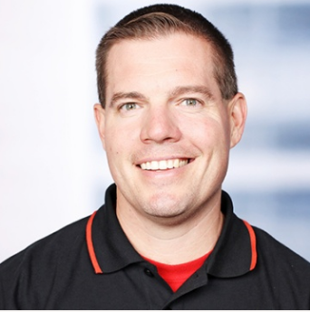
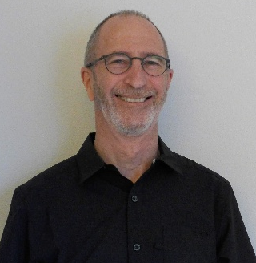
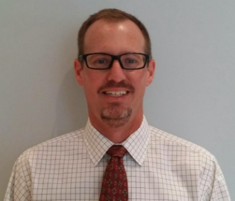

# Below are the Engineers that will be Supporting your Event

<table class="hubperson"><tr>
<td class="sepicture"></td>
<td>
Chip Baber

NAC Lead, Developer Innovations Team

[LinkedIn](https://www.linkedin.com/in/chipbaber)

</td></tr><tr><td colspan="2">
**About**

Seeing technology in action, in context of the business can truly bring ideas to life. As the Director of the Oracle Cloud Solution Hubs, Developer Innovation Team I lead a group of highly skilled technical engineers as they work with developers to visualize new possibilities in the Cloud. It is not just about showcasing Cloud, it is about making the Cloud to life through entertaining, programmatic hands on experiences. I lead Oracle's Code Innovate, Cloud Coaching and Cloud Accelerate programs for Oracle's NAC division. At my core I am both a programmer and a creative. I thrive analyzing complex problems and leveraging IaaS and PaaS Cloud solutions to innovate.

</td></tr><tr><td colspan="2">
**Hobbies or Interests***

Baseball, Nascar, DraftKings

</td></tr></table>

**Chip Baber - Event Director**
---
[Linkedin](https://www.linkedin.com/in/chipbaber)

__My Work Passion:__  Seeing technology in action, in context of the business can truly bring ideas to life. As the Director of the Oracle Cloud Solution Hubs, Developer Innovation Team I lead a group of highly skilled technical engineers as they work with developers to visualize new possibilities in the Cloud. It is not just about showcasing Cloud, it is about making the Cloud to life through entertaining, programmatic hands on experiences. I lead Oracle's Code Innovate, Cloud Coaching and Cloud Accelerate programs for Oracle's NAC division. At my core I am both a programmer and a creative. I thrive analyzing complex problems and leveraging IaaS and PaaS Cloud solutions to innovate.

__My Leisure Passion:__  

 **Derrick Cameron - Engineering Team Lead**
---
 [Linkedin](https://www.linkedin.com/in/derrick-cameron-b96408)

__My Work Passion:__  After over 20 years at Oracle I still like the constant change and opportunity to build expertise on emerging technologies. In my technical sales role I enjoy the combination of hands on development work and the personal/social side of customer facing presentations and discussions.

__My Leisure Passion:__ Playing squash!  Living in the pacific northwest I enjoy hiking, local Portland brewpubs, and hanging out with family.

 **Steven Nichols - Engineering Team Lead**
---
 [Linkedin](https://www.linkedin.com/in/steve-nichols-820b634)

__My Work Passion:__

__My Leisure Passion:__
